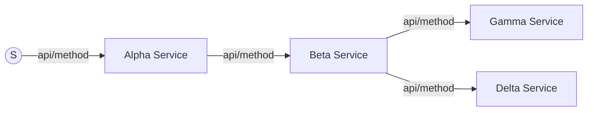
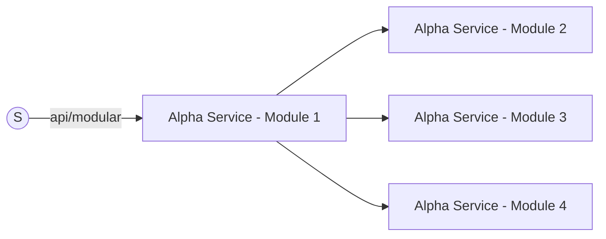
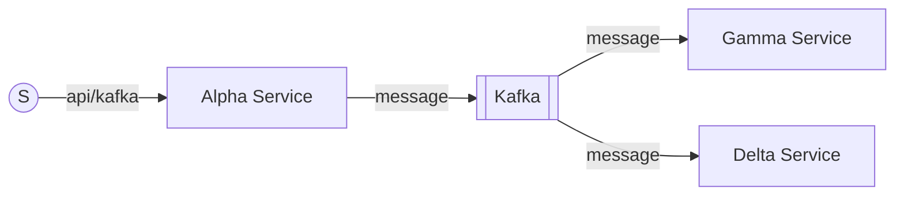

# Observability demo

### Run

```
docker compose up -d
```

### Serial calling of services


```mermaid
flowchart LR
  start((S))
  alpha[Alpha Service]
  beta[Beta Service]
  gamma[Gamma Service]
  delta[Delta Service]

  start -->|api/method| alpha
  alpha -->|api/method| beta
  beta -->|api/method| gamma
  beta -->|api/method| delta
```

### Creating Spans


```mermaid
flowchart LR
  start((S))
  m1[Alpha Service - Module 1]
  m2[Alpha Service - Module 2]
  m3[Alpha Service - Module 3]
  m4[Alpha Service - Module 4]

  start -->|api/modular| m1
  m1 --> m2
  m1 --> m3
  m1 --> m4
```

### Kafka


```mermaid
flowchart LR
  start((S))
  kafka[[Kafka]]
  alpha[Alpha Service]
  gamma[Gamma Service]
  delta[Delta Service]

  start -->|api/kafka| alpha
  alpha -->|message| kafka
  kafka -->|message| gamma
  kafka -->|message| delta
```